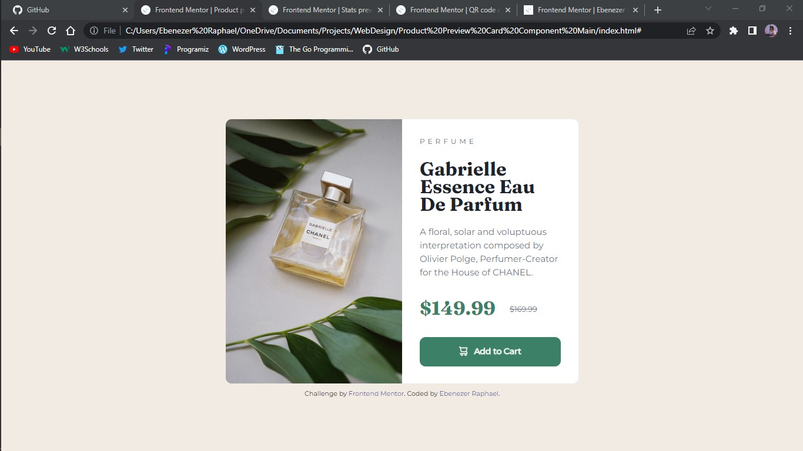

# Frontend Mentor - Product preview card component solution

This is a solution to the [Product preview card component challenge on Frontend Mentor](https://www.frontendmentor.io/challenges/product-preview-card-component-GO7UmttRfa). Frontend Mentor challenges help you improve your coding skills by building realistic projects.

## Table of contents

- [Overview](#overview)
  - [The challenge](#the-challenge)
  - [Screenshot](#screenshot)
  - [Links](#links)
- [My process](#my-process)
  - [Built with](#built-with)
  - [What I learned](#what-i-learned)
  - [Continued development](#continued-development)
  - [Useful resources](#useful-resources)
- [Author](#author)

**Note: Delete this note and update the table of contents based on what sections you keep.**

## Overview

### The challenge

Users should be able to:

- View the optimal layout depending on their device's screen size
- See hover and focus states for interactive elements

### Screenshot



### Links

- Solution URL: [GitHub](https://github.com/ebenezerraph/product-preview-card-component/)
- Live Site URL: [Product Preview Card Component](https://ebenezerraph.github.io/product-preview-card-component/)

## My process

### Built with

- Semantic HTML5 markup
- CSS custom properties
- JavaScript

### What I learned

I learnt how to deploy the optimal layout depending on their device's screen size.

```js
var width = window.innerWidth;

var styles = document.getElementById('styles');
var img = document.getElementById('img');

var stylesContainer = styles.parentNode;
var imgContainer = img.parentNode;

var stylesPosition = document.getElementById('styles-container');
var imgPosition = document.getElementById('img-container');

if (width < 700) {    
    stylesContainer.removeChild(styles);
    imgContainer.removeChild(img);

    stylesPosition.innerHTML = '<link rel="stylesheet" href="mobile-styles.css">';
    imgPosition.innerHTML = '';
}

```

### Continued development

I want to be able to optimize my code. 

### Useful resources

- [HTML & CSS: Design and Build Web Sites - Book by Jon Duckett](https://www.htmlandcssbook.com/) - This helped me to address minor issues in my code and I will use it going forward.
- [HTML & CSS: Design and Build Web Sites - Book by Jon Duckett](https://javascriptbook.com/) - This helped me to address minor issues in my code and I will use it going forward.

## Author

- GitHub - [@ebenezerraph](https://www.github.com/ebenezerraph)
- Frontend Mentor - [@ebenezerraph](https://www.frontendmentor.io/profile/ebenezerraph)
- Twitter - [@EbenezerRaph](https://www.twitter.com/EbenezerRaph)
